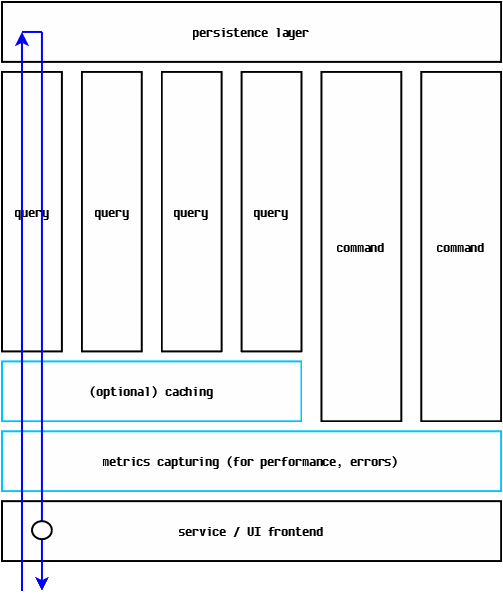

# Why use Functional.CQS.AOP?
`Functional.CQS.AOP` makes it easy to apply cross-cutting concerns to [`Functional.CQS` handler implementations](https://github.com/RyanMarcotte/Functional.CQS/tree/master/src/Functional.CQS) by supplying pluggable abstractions and - when DI containers are involved - handling common bootstrapping.  The separation of cross-cutting concerns from business logic is [aspect-oriented programming](https://en.wikipedia.org/wiki/Aspect-oriented_programming) (AOP).

An example CQS-based architecture is illustrated below:

With `Functional.CQS.AOP`, we achieve the following:

We now have introduced cross-cutting concerns:
- we route all query and command handler invocations through metrics-capturing infrastructure so that service level indicators (like performance timings and error rates) can be logged
- we route all query handler invocations through opt-in caching infrastructure; if a specific query handler opts into caching, this reduces the load on the persistence layer

Note that these concerns are applied such that they are totally separate from the query and command handlers themselves.  This encapsulation is a good example of the [single-responsibility principle](https://en.wikipedia.org/wiki/Single_responsibility_principle) in action.
