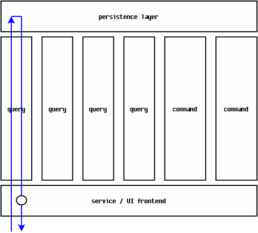

# What is CQS?
CQS stands for "command-query separation".  Rather than duplicating effort for explaining the fundamentals here, please reference the following:
- [CommandQuerySeparation](http://martinfowler.com/bliki/CommandQuerySeparation.html), by Martin Fowler
- [Wikipedia page on CQS](https://en.wikipedia.org/wiki/Command%E2%80%93query_separation)
- [Meanwhile... on the command side of my architecture](https://cuttingedge.it/blogs/steven/pivot/entry.php?id=91), by Steven van Deursen (recommended! more theory for commands; includes code examples) 
- [Meanwhile... on the query side of my architecture](https://cuttingedge.it/blogs/steven/pivot/entry.php?id=92), by Steven van Deursen (recommended! more theory for queries; includes code examples)
- [SOLID Architecture in Slices not Layers](https://www.youtube.com/watch?v=wTd-VcJCs_M), by Jimmy Bogard

Conceptually, *CQS handler implementations are specifically for interacting with the underlying system state*.  This is derived from Martin Fowler's page linked above:
>The fundamental idea is that we should divide an [application]'s methods into two sharply separated categories:
>- Queries: Return a result and do not change the observable state of the system (are free of side effects).
>- Commands: Change the state of a system but do not return a value.

# Why use CQS?
With CQS, we keep code modular and easy to understand.  If you design the business logic in a way that the read and write operations will be separate from each other, it will help reduce the number of errors caused by some unknown behavior or side effect.  An example CQS-based architecture is illustrated below.

Note the flow of control (represented by the blue arrow).  A user action in the UI or an incoming HTTP request handled by some service API controller delegates execution to one CQS handler (labelled `query` or `command` above).  The individual query and command handlers are kept independent from each other so that they can evolve independently according to changing business requirements.  In the example flow above, once query handler execution has completed (represented by the circle), the service / UI frontend is responsible for returning / displaying the results of that query in an appropriate format.
